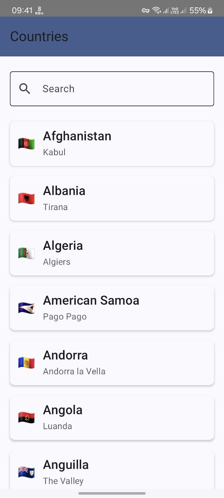
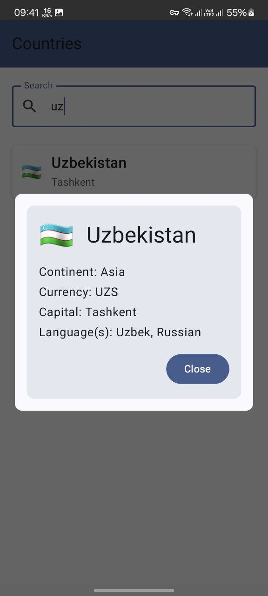

## Screenshots

 

## Technologies Used

- **GraphQL**: Query language for APIs, providing an efficient alternative to REST.
- **Apollo 3**: GraphQL client with strong type generation.
- **Kotlin**: Statically-typed programming language for modern applications.
- **Jetpack Compose**: UI toolkit for declaratively building native Android UIs.
- **MVVM Architecture**: Organizes code using Model-View-ViewModel pattern.
- **Dagger Hilt**: Dependency injection library for Android.
- **Kotlin Coroutines**: Simplifies asynchronous programming in Kotlin.
- **Material Design**: Google's design language for aesthetic and functional UI/UX.

